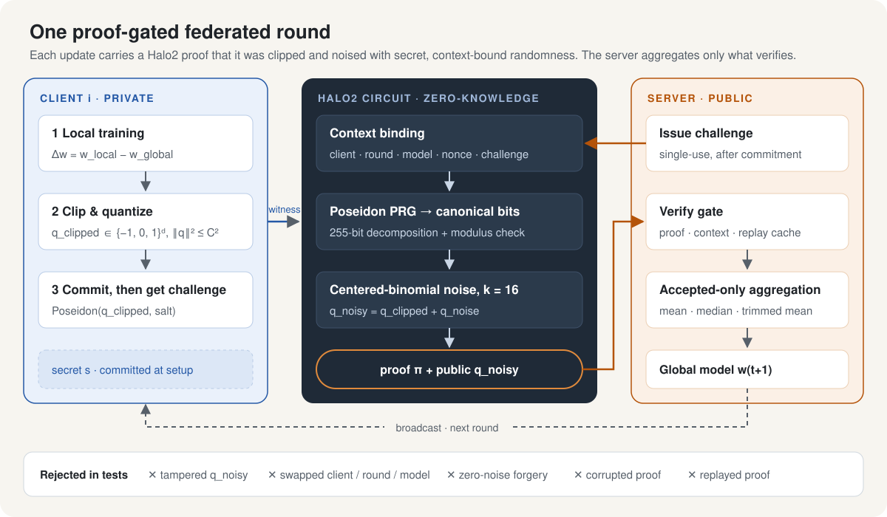
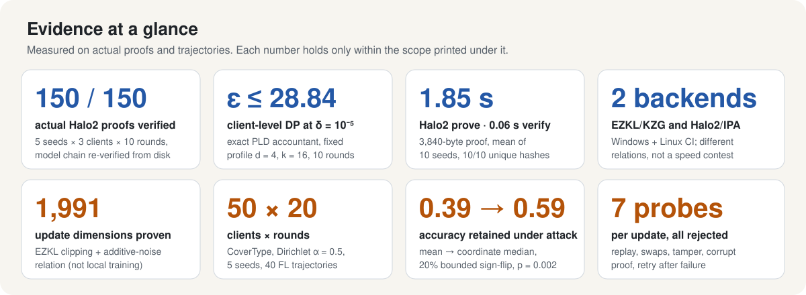
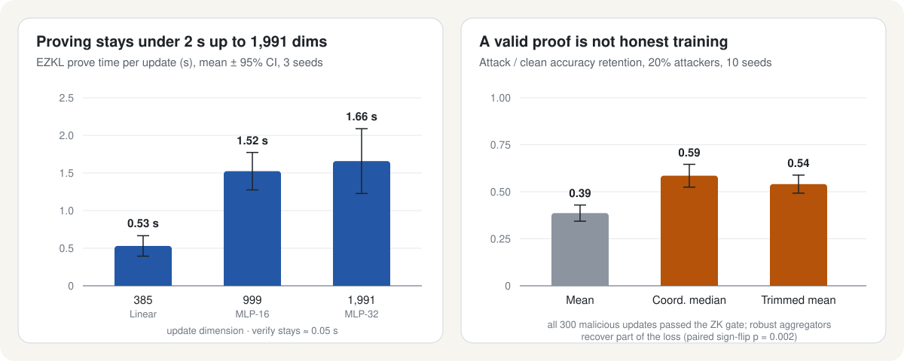

# zk-verifiable-dp-fl

**可驗證差分隱私聯邦學習（VDP-FL）**：讓每一份 client update 附上零知識證明，證明它確實經過 clipping、並以秘密且綁定情境的隨機性加入差分隱私噪聲；server 只聚合驗證通過的更新。

*Verifiable differential privacy for federated learning — every client update carries a zero-knowledge proof (Halo2 / EZKL) that it was clipped and noised correctly, and only verified updates are aggregated.*

[](https://github.com/ChiJiun/zk-verifiable-dp-fl/actions/workflows/reproducibility-matrix.yml)

## 為什麼需要

在一般的 DP 聯邦學習中，server 只能「相信」client 有照規定 clip 並加噪。惡意或偷懶的 client 可以送出未加噪、未 clip 的更新，而 server 無從察覺。本專案把 DP update 轉成可由零知識證明審計的介面：

- **隱私**：client 的原始更新、秘密種子與噪聲值都留在 private witness，不公開。
- **可驗證**：proof 綁定 client、round、model、nonce 與 server challenge，無法重播或挪用到其他情境。
- **可控制聚合**：驗證結果直接決定該更新是否進入 FedAvg／robust aggregation。

## 系統架構



1. **Client** 在本地訓練得到 `Δw`，clip 並量化成 `q_clipped`，先送出 Poseidon commitment。
2. **Server** 在收到 commitment *之後*才發出一次性的 challenge（commit-before-challenge）。
3. **Halo2 circuit** 以 setup 時承諾的秘密 `s` 與完整 context 產生 Poseidon PRG 輸出，經 canonical 255-bit 分解後取 bits，組成 `k=16` 的 centered-binomial 噪聲，並證明 `q_noisy = q_clipped + q_noise`。
4. **Server** 驗證 proof、context 與 replay cache，只把通過的更新送進 mean／coordinate median／trimmed mean 聚合，再廣播下一輪模型。

## 實驗結果





右圖是本專案刻意保留的負面結果：在 clipping 範圍內反向放大更新的攻擊者，其 300/300 份更新全數通過 ZK gate。**Update-level proof 不等於 local-training provenance**，因此另外以 robust aggregation 緩解，但仍無法完全消除 utility loss。

### 主張邊界

| 可以宣稱 | 不可以宣稱 |
|---|---|
| Hidden randomness、Poseidon PRG、centered-binomial sampler、clipping 與 additive-noise relation 已整合進 actual Halo2 proof | 任意維度、任意 rounds 的統一 ε；高維實驗不繼承四維 theorem |
| 固定四維 profile（`d=4, k=16`, 10 rounds）下 replacement client-level `ε ≤ 28.840669` at `δ = 1e-5` | 完整自適應 FL transcript 的 DP（commitment hiding、PRF/ZK simulation 仍待審查） |
| 3 clients × 10 rounds × 5 seeds 共 150 份逐更新 proof 全數通過，並可從磁碟重建模型鏈 | 已證明 local training 正確，或能防禦任意 poisoning／Byzantine 攻擊 |
| 385–1,991 維 EZKL constraint proof、50 clients × 20 rounds 的 FL scaling | Production 部署效能；1,000-proof workload 為外推值 |

Poseidon 的 computational-DP 結論依賴 PRF、unique context、setup commitment、commit-before-challenge 與 secret non-disclosure 等假設。完整討論見 [`docs/publication_strengthening_report.md`](docs/publication_strengthening_report.md)。

## 快速開始

需求：Python（CI 使用 3.12）、Rust stable。

```powershell
pip install -r requirements.txt

# Halo2 可驗證隨機性 circuit：測試與單次 actual proof
cd halo2_verifiable_randomness
cargo test --release
cargo run --release -- results/halo2_context_noise_proof.json 42
cd ..

# 離散噪聲 accountant、跨 seed 重現、scaling 與 robust aggregation
python discrete_noise_accounting/centered_binomial_accountant.py
python cross_backend_reproducibility/run_halo2_seed_benchmark.py
python production_scaling/run_production_scaling.py
python robust_aggregation/run_robust_aggregation.py
```

逐更新 Halo2 多輪實驗（產生 proof、驗證後聚合、從磁碟重驗模型鏈）請見 [`actual_multiround_halo2/README.md`](actual_multiround_halo2/README.md)。

## 研究主線

Repository 依研究功能與實驗里程碑組織：從 S0 FedAvg、S1 DP update，到 S2 proof-gated aggregation，再延伸至可驗證隨機性與投稿強化。

| 研究單元 | 內容 | 主要目錄 |
|---|---|---|
| 基礎模型與證明流程 | PyTorch／ONNX／EZKL、Adult Income、量化尺度、FedAvg 與 DP baseline | `zk_ezkl_demo/`、`adult_income_model/`、`quantization_scale_sweep/`、`fedavg_baseline/`、`dp_fedavg_baseline/` |
| DP update 約束工程 | Clipping、noise relation、canonical quantized witness、constraint profile 與 artifact | `clipping_verification/`、`noise_relation_verification/`、`quantized_constraint_analysis/`、`canonical_witness/`、`constraint_profile/`、`constraint_artifacts/` |
| Proof-gated aggregation | Backend bundle、actual EZKL integration、驗證後聚合與端到端 round | `zk_backend_bundle/`、`ezkl_constraint_integration/`、`proof_gated_round/`、`end_to_end_proof_gated_round/` |
| 泛化與成本評估 | Binary／multiclass repeatability、完整 update proof、ZK cost 與 CoverType scaling | `breast_cancer_repeatability/`、`binary_dataset_repeatability/`、`multiclass_repeatability/`、`multiclass_vdp_zk/`、`zk_cost_scaling/`、`covertype_large_dataset_scaling/` |
| Privacy 與威脅分析 | Gaussian accountant、non-IID clients、多輪攻擊矩陣及統計稽核 | `gaussian_privacy_accounting/`、`noniid_client_scaling/`、`multiround_threat_matrix/`、`experimental_rigor_audit/` |
| 可驗證隨機性 | Commit-before-challenge、hidden randomness、Poseidon PRG、離散 sampler 與正式 accountant | `context_bound_randomness_protocol/`、`halo2_verifiable_randomness/`、`discrete_noise_accounting/` |
| 投稿強化 | Cross-backend／硬體重現、較大型 federation 與 bounded-poisoning defense | `cross_backend_reproducibility/`、`production_scaling/`、`robust_aggregation/` |
| 逐更新多輪證明 | 每份更新產生 actual Halo2 proof、accepted-only aggregation、磁碟重驗 | `actual_multiround_halo2/` |

<details>
<summary><b>完整目錄說明</b></summary>

### 基礎模型與 FL／DP baselines

- `zk_ezkl_demo/`：最小 EZKL train/export/prove/verify pipeline。
- `adult_income_model/`：Adult Income preprocessing、模型訓練與 EZKL artifacts。
- `quantization_scale_sweep/`：量化 scale 對 accuracy 與 proving cost 的影響。
- `baseline_charts/`：基礎實驗視覺化。
- `fedavg_baseline/`、`fedavg_round_charts/`：FedAvg 與 round-accuracy baseline。
- `dp_fedavg_baseline/`、`privacy_utility_sweep/`：clipping/noise updater 與早期 privacy-utility sweep。

### 約束、proof 與聚合

- `clipping_verification/`、`noise_relation_verification/`：DP update 原始條件驗證。
- `quantized_constraint_analysis/`、`canonical_witness/`、`constraint_profile/`：fixed-point constraint、canonical witness 與 slack policy。
- `constraint_artifacts/`、`zk_backend_bundle/`：可重現 statement/witness bundles。
- `ezkl_constraint_integration/`：actual EZKL constraint proof。
- `proof_gated_round/`、`end_to_end_proof_gated_round/`：accepted-only aggregation 與模型回寫。

### 泛化、成本與隱私分析

- `breast_cancer_repeatability/`、`binary_dataset_repeatability/`、`multiclass_repeatability/`：跨資料集 paired experiments。
- `multiclass_vdp_zk/`、`zk_cost_scaling/`：完整 update proof 與 rows/time/RSS/payload scaling。
- `gaussian_privacy_accounting/`：public-seed limitation、Gaussian RDP 與 privacy-utility frontier。
- `covertype_large_dataset_scaling/`、`noniid_client_scaling/`：581,012-row CoverType、IID/Dirichlet 與 client-count scaling。
- `multiround_threat_matrix/`：relation tamper、clip bypass、replay、zero noise 與 bounded sign flip。
- `experimental_rigor_audit/`：矩陣完整性、paired statistics、Holm correction、環境與 SHA-256 稽核。

### 可驗證隨機性與投稿強化

- `context_bound_randomness_protocol/`：setup commitment、commit-before-challenge、freshness 與 replay semantics。
- `halo2_verifiable_randomness/`：actual Halo2/Poseidon hidden-randomness sampler circuit。
- `discrete_noise_accounting/`：exact centered-binomial PLD theorem/accountant。
- `cross_backend_reproducibility/`：10-seed proofs、硬體 manifest 與跨 OS CI。
- `production_scaling/`：385–1,991 維 actual EZKL，以及 K=10–50、R=3–20 FL scaling。
- `robust_aggregation/`：mean、coordinate median、trimmed mean 的 bounded-poisoning evaluation。
- `actual_multiround_halo2/`：四參數合成資料、3 clients × 10 rounds 的逐更新 actual Halo2 proof 與模型鏈重驗。

</details>

## 文件

- [`docs/publication_strengthening_report.md`](docs/publication_strengthening_report.md)：正式結論、限制與可使用主張
- [`docs/VDP-FL-research-plan.md`](docs/VDP-FL-research-plan.md)：研究規劃
- [`docs/system_architecture_explanation.md`](docs/system_architecture_explanation.md)：系統架構逐節點說明
- [`docs/hypothesis_evidence_matrix.md`](docs/hypothesis_evidence_matrix.md)：假說與證據對照
- [`actual_multiround_halo2/hackmd_update.md`](actual_multiround_halo2/hackmd_update.md)：逐更新多輪實驗報告

## 主要參考

[Zcash Halo2](https://github.com/zcash/halo2) · [EZKL](https://github.com/zkonduit/ezkl) · [Koskela et al., exact PLD accounting](https://proceedings.mlr.press/v130/koskela21a.html) · [cpSGD binomial mechanism](https://arxiv.org/abs/1805.10559) · [Byzantine-robust median / trimmed mean](https://arxiv.org/abs/1803.01498)
