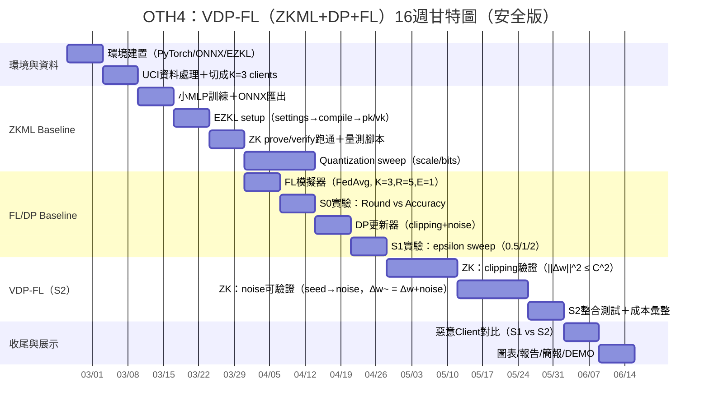

# OTH4：VDP-FL（ZKML + DP + FL）16週計劃

## 計畫目標

本計畫的核心目標是建立一個可驗證的聯邦學習原型，逐步完成以下三個系統層級：

- `S0`: FL baseline
- `S1`: FL + Differential Privacy
- `S2`: FL + Differential Privacy + Zero-Knowledge Verification

最終希望能回答三個問題：

1. 聯邦學習在目前資料與模型設定下是否能穩定收斂
2. 加入 DP 後，隱私保護與模型效能之間的權衡是什麼
3. 加入 ZK 驗證後，是否能在可接受成本下提升系統可信度

## 主要量化指標

- Accuracy
- Proving time
- Verification time
- Proof size
- Peak memory
- Round time
- Communication overhead

## 16 週甘特圖

## 當前進度對齊

目前 repo 中已經完成或部分完成的內容如下：

- Week 1：已完成 EZKL demo baseline
- Week 2：已完成 UCI Adult Income 前處理、模型訓練、ZK pipeline，並已補上 `K=3` client split
- Week 3：已建立 scale sweep 腳本與 CSV 輸出骨架；完整 prove/verify 量測需在安裝 `ezkl` 的環境執行

因此，下面的週計畫同時兼具兩個用途：

- 作為正式的 16 週研究時程
- 作為目前 repo 的實作對照表

---

## Week 1：環境建置（PyTorch / ONNX / EZKL）

**期間：** 2026-02-24 至 2026-03-02

**目標**

- 建立 ZKML 開發環境
- 跑通最小可行 pipeline：`PyTorch -> ONNX -> EZKL -> prove -> verify`
- 確認工具鏈版本與 API 相容性

**主要工作**

- 建立 Python / conda 環境
- 安裝 `torch`、`onnx`、`ezkl`
- 測試模型匯出為 ONNX
- 產生 settings、compile 電路、setup keys
- 完成 proof 生成與 verify

**預期產出**

- `week1_demo/` 中可執行的 demo pipeline
- 一份成功通過的 proof
- 可重現的執行步驟

**驗收標準**

- `verify` 成功通過
- demo pipeline 可從頭執行
- 關鍵版本與 API 用法已記錄

**風險**

- EZKL API 變動
- ONNX opset 或 operator 不相容

---

## Week 2：UCI 資料處理＋切成 K=3 clients

**期間：** 2026-03-03 至 2026-03-09

**目標**

- 以真實資料集建立後續實驗基礎
- 完成 FL baseline 所需的 client 資料切分
- 保留與 ZKML 相容的特徵與模型設計空間

**主要工作**

- 下載 UCI Adult Income 資料
- 移除缺失值並完成類別編碼
- 進行標準化與 train/test split
- 將訓練集切為 `K=3` clients
- 輸出 `processed` 與 `clients` 兩類資料

**預期產出**

- `week2_uci_model/data/processed/`
- `week2_uci_model/data/clients/`
- `metadata.json` 記錄每個 client 的樣本數與 label 比例

**驗收標準**

- 資料前處理腳本可重跑
- `K=3` client split 成功輸出
- 每個 client 樣本分布合理且無空集合

**目前狀態**

- 已完成並已在 repo 實作

**風險**

- client label 分布過度失衡
- 前處理方式若後續改動，需重新生成所有輸出

---

## Week 3：小 MLP 訓練＋ONNX 匯出

**期間：** 2026-03-10 至 2026-03-16

**目標**

- 建立可在 EZKL 中處理的模型
- 驗證真實資料上的基本準確率
- 產生穩定可重用的 ONNX 模型檔

**主要工作**

- 設計 EZKL 可相容的小型模型
- 測試 MLP 與純線性模型的可行性
- 使用 `BCEWithLogitsLoss` 訓練
- 匯出 ONNX 並驗證格式

**預期產出**

- `adult_income_model.onnx`
- 測試集 accuracy baseline
- 模型架構與限制說明

**驗收標準**

- ONNX 可被正常載入
- 模型在測試集有可接受準確率
- 匯出後能銜接 EZKL pipeline

**目前狀態**

- 已完成；目前採用純線性模型作為 ZKML 相容版本

**風險**

- 含激活函數的模型可能無法被 EZKL 支援
- 模型複雜度提高會顯著增加 proving 成本

---

## Week 4：EZKL setup（settings → compile → pk/vk）

**期間：** 2026-03-17 至 2026-03-23

**目標**

- 完成 ONNX 到電路的轉換流程
- 產出 setup 所需檔案與 proving / verifying keys

**主要工作**

- `gen_settings`
- `calibrate_settings`
- `compile_circuit`
- `setup`
- 檢查 `settings.json`、`network.ezkl`、`pk.key`、`vk.key`

**預期產出**

- `src/settings.json`
- `src/network.ezkl`
- `results/pk.key`
- `results/vk.key`

**驗收標準**

- setup 成功完成
- 所有關鍵檔案產出完整
- pipeline 可以銜接到 prove / verify 階段

**目前狀態**

- 已完成基本版本

**風險**

- 量化參數設定不佳會影響後續 prove 或 accuracy
- SRS 管理與檔案大小可能影響可攜性

---

## Week 5：ZK prove / verify 跑通＋量測腳本

**期間：** 2026-03-24 至 2026-03-30

**目標**

- 在真實資料模型上完成 prove / verify
- 建立量測 proving time、verify time、proof size 的腳本

**主要工作**

- `gen_witness`
- `prove`
- `verify`
- 寫入量測腳本與結果紀錄格式
- 建立後續比較用的 baseline 數據

**預期產出**

- `proof.json`
- 成本量測表
- 一份可重複執行的 ZK pipeline

**驗收標準**

- verify 成功
- 至少能記錄 prove time、verify time、proof size
- 結果可寫入 CSV 或 JSON

**目前狀態**

- 基本 pipeline 已完成；完整量測腳本已部分實作

**風險**

- proving 成本可能高於預期
- 環境未裝 `ezkl` 時無法在所有機器上重跑

---

## Week 6-7：Quantization sweep（scale / bits）

**期間：** 2026-03-31 至 2026-04-13

**目標**

- 評估不同量化設定對模型 accuracy 與 ZK 成本的影響
- 為後續圖表與模型選型建立依據

**主要工作**

- 測試 `scale = 8 / 12 / 16`
- 若可行，再補 `bits` 或其他量化參數
- 比較 quantized accuracy
- 比較 prove / verify 成本
- 輸出 CSV

**預期產出**

- `week3_scale_sweep/results/scale_sweep_results.csv`
- scale / bits 與 accuracy / cost 對照表

**驗收標準**

- 至少完成 3 組 scale 比較
- 每組結果有 accuracy 與成本欄位
- 結果可直接供 Week 8 繪圖

**目前狀態**

- scale sweep 腳本已建立並可輸出 accuracy CSV
- 完整 prove / verify 成本量測待 `ezkl` 環境補跑

**風險**

- scale 調整後 accuracy 變化不明顯
- bits 參數可能受限於 EZKL 設定格式

---

## Week 8：FL 模擬器（FedAvg, K=3, R=5, E=1）

**期間：** 2026-04-14 至 2026-04-20

**目標**

- 建立聯邦學習 baseline 訓練流程
- 使用 Week 2 的 client split 執行多輪聚合

**主要工作**

- 建立 `K=3` client local training
- 實作 `FedAvg`
- 設定 `R=5, E=1`
- 在每輪後評估 global model

**預期產出**

- FL simulator 腳本
- 每輪 accuracy 紀錄
- 初版 global / local training 日誌

**驗收標準**

- 可完整跑完 5 輪訓練
- 聚合後模型有可追蹤 accuracy 變化
- 結果可輸出成表格

**風險**

- 本地訓練與 global aggregation 介面設計不當
- client data 分布造成收斂不穩

---

## Week 9：S0 實驗：Round vs Accuracy

**期間：** 2026-04-21 至 2026-04-27

**目標**

- 建立 FL baseline（S0）的基準曲線

**主要工作**

- 固定模型與資料設定
- 記錄每輪 accuracy
- 匯出繪圖用資料
- 分析是否有明顯震盪或過擬合

**預期產出**

- `Round vs Accuracy` 表格
- S0 baseline 圖

**驗收標準**

- 至少能重現一條穩定曲線
- 結果可供之後與 S1 / S2 比較

**風險**

- 只有 5 輪時曲線訊號不足
- local epoch 設定可能影響對比公平性

---

## Week 10：DP 更新器（clipping + noise）

**期間：** 2026-04-28 至 2026-05-04

**目標**

- 將差分隱私更新器加入聯邦學習流程

**主要工作**

- 計算 client update `Δw`
- 實作 clipping
- 加入 Gaussian noise
- 定義 DP 相關超參數

**預期產出**

- DP updater 模組
- 可切換 S0 / S1 的實驗腳本

**驗收標準**

- clipping 與 noise 可正確套用
- pipeline 不因加入 DP 而中斷

**風險**

- noise 過大導致模型嚴重退化
- clipping threshold 難以選定

---

## Week 11：S1 實驗：epsilon sweep（0.5 / 1 / 2）

**期間：** 2026-05-05 至 2026-05-11

**目標**

- 量化隱私與效能的取捨

**主要工作**

- 測試 `epsilon = 0.5 / 1 / 2`
- 記錄 accuracy 與可能的訓練穩定性
- 匯出繪圖資料

**預期產出**

- `epsilon vs accuracy` 表格與圖
- S1 實驗摘要

**驗收標準**

- 至少完成 3 組 epsilon 設定
- 結果可與 S0 baseline 直接比較

**風險**

- ε 定義與實作方式需保持一致
- 實驗差異可能需要多次重跑才能看出趨勢

---

## Week 12-13：ZK：clipping 驗證（||Δw||^2 ≤ C^2）

**期間：** 2026-05-12 至 2026-05-25

**目標**

- 將 DP 的 clipping 條件轉成可驗證的 ZK constraint

**主要工作**

- 設計 clipping constraint
- 將 `||Δw||^2 ≤ C^2` 映射到可驗證形式
- 建立 success / fail case
- 量測 proof 生成與驗證成本

**預期產出**

- clipping verification prototype
- fail case 測試結果

**驗收標準**

- 正常更新可通過 proof
- 超出 clipping bound 的更新可觸發 fail case

**風險**

- 向量維度與電路大小使 proving 成本暴增
- constraint 設計可能需先做簡化版驗證

---

## Week 14-15：ZK：noise 可驗證（seed → noise，Δw~ = Δw + noise）

**期間：** 2026-05-26 至 2026-06-08

**目標**

- 讓 DP noise 的生成與套用也能被驗證

**主要工作**

- 設計從 seed 生成 noise 的可驗證流程
- 驗證 `Δw~ = Δw + noise`
- 建立篡改 noise 的 fail case

**預期產出**

- noise verification prototype
- success / fail case 對照結果

**驗收標準**

- 正確 noise 可通過 proof
- 被修改的 noise 或 update 會驗證失敗

**風險**

- 可驗證 noise 生成可能需要額外簡化假設
- 隨機性與可重現性之間需明確定義

---

## Week 16：S2 整合測試＋成本彙整

**期間：** 2026-06-09 至 2026-06-15

**目標**

- 完成 `S2 = FL + DP + ZK` 的整體串接
- 對照 S0 / S1 / S2 的成本與效能

**主要工作**

- 整合 FL、DP、ZK 三部分
- 記錄 accuracy、proof size、prove / verify time、memory
- 彙整對照表

**預期產出**

- S2 prototype
- S0 / S1 / S2 比較表

**驗收標準**

- S2 可至少完成一輪端到端流程
- 有可報告的成本與效能摘要

**風險**

- 系統整合點多，debug 成本高
- S2 執行時間可能需要分階段拆測

---

## 延伸收尾任務

雖然甘特圖將最後兩項列在 S2 之後，實務上建議保留緩衝時間：

### 惡意 Client 對比（S1 vs S2）

- 模擬惡意 client 上傳不合法 update
- 比較 S1 無法防擋與 S2 可驗證攔截的差異

### 圖表 / 報告 / 簡報 / Demo

- 整理所有圖表
- 完成論文或報告章節
- 準備教授報告或 demo 展示

---

## 建議交付節奏

為了讓每週都有可展示內容，建議每週至少固定產出一項：

- 一個可執行腳本
- 一份結果 CSV / JSON
- 一張圖
- 一段實驗記錄或 README 更新

這樣即使後續 ZK 與 DP 整合階段變複雜，仍能持續累積可報告成果。
