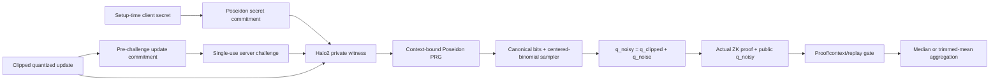

# VDP-FL 投稿強化實驗報告

日期：2026-08-06

> 後續更新：新增 `actual_multiround_halo2/`，以四參數合成資料評估逐更新 actual Halo2 proof 與模型鏈磁碟重驗。完成數量、成本、失敗紀錄與可貼入 HackMD 的正文見 `actual_multiround_halo2/hackmd_update.md`。該實驗不將本文固定-profile accountant 直接升格為完整自適應 FL transcript 的 DP 證明；commitment hiding、PRF/ZK simulation 與適應性 composition 仍須整體安全審查。

## 摘要與判定

本階段針對前一版結案報告列出的五個投稿缺口逐項實作。結果不再只是協定草圖：context-bound hidden randomness、Poseidon PRG 與 centered-binomial sampler 已進入真正的 Zcash Halo2 circuit；exact sampler 已有 replacement client-level DP theorem 與可執行的 conservative privacy-loss accountant；新增 10 個 independent seeds、硬體 manifest、Halo2/EZKL 兩種 actual proof backend 及 Windows/Linux CI；CoverType 實驗擴至 1,991 個參數、50 clients、20 rounds；bounded poisoning 則以 coordinate median 與 trimmed mean 實測緩解。

精確結論是：**五項工程目標均已有可執行實作與結果，但保證範圍不是「完整 production VDP-FL」。** 固定四維 sampler profile 可宣稱有限 epsilon；高維 FL scaling 與 robust aggregation 是獨立的 system experiments，不能把四維 accountant 自動套到 385–1,991 維模型。Robust aggregation 顯著減輕所測攻擊，但沒有證明 local training，也沒有完全消除 utility loss。

| 要求 | 完成狀態 | 最主要證據 | 主張邊界 |
|---|---|---|---|
| Hidden randomness／PRG／sampler 進 ZK circuit | 已完成固定 profile | Halo2 verifiable-randomness circuit actual Halo2 proof、4/4 circuit tests | `d=4, k=16, C²=4`；freshness/replay cache 仍是 host state machine |
| 正式 client-level DP theorem/accountant | 已完成固定 profile | discrete-noise accounting exact PLD，ε≤28.840669 at δ=1e-5 | Replacement-client adjacency、fixed participation；real Poseidon 為 conditional computational DP |
| Seeds、硬體、backend | 已完成本機，CI 已建置 | cross-backend reproducibility 本機 10/10 proofs；EZKL + Halo2；Windows/Linux workflow | 兩 backend circuit 不相同，不能當受控效能比較；雲端 runner 結果須以 CI artifact 為準 |
| 模型、clients、rounds scaling | 已完成 production-oriented stress test | production-oriented scaling：9 actual EZKL proofs、40 FL trajectories、最多 50×20 | 全量逐更新 proof latency 是外推；local optimizer 不在 proof circuit |
| Local provenance 或 robust aggregation | 已完成 robust-aggregation 分支 | robust aggregation：60 trajectories、3,000 decisions、10 seeds | 顯著緩解 20% bounded sign-flip，未證明任意 Byzantine robustness |

## 一、整合後架構

Public statement 包含 client、round、model、nonce、challenge、secret commitment、update commitment、固定 clipping bound 與 `q_noisy`。Private witness 包含 client secret、salt 與 `q_clipped`；PRG outputs、sampler bits 與 `q_noise` 都不寫入公開結果。Server 的 commit-before-challenge、single-use challenge 與 replay cache 沿用 context-bound randomness protocol state machine；circuit 證明其公開 context 與 commitment 的一致性，但伺服器端唯一性仍需由 protocol state 維持。

## 二、Actual Halo2 sampler circuit

### 2.1 實作內容

Halo2 verifiable-randomness circuit 使用 Zcash Halo2 IPA/Pasta 與 Poseidon gadget，實際約束：

1. setup-time secret commitment 開啟正確；
2. `q_clipped` 與 salt 開啟 pre-challenge update commitment；
3. client/round/model/nonce/update commitment/challenge 全部折入 context；
4. secret 與 context 形成 keyed Poseidon PRG；
5. 每個 field output 先做 canonical 255-bit decomposition 與 modulus comparison，再取低 `2k` bits；
6. `k=16` centered-binomial noise 等於 16 個正 bits 減 16 個負 bits；
7. `q_clipped∈{-1,0,1}`、平方範數不超過固定 `C²=4`，且 `q_noisy=q_clipped+q_noise`。

Canonical decomposition 是必要修正：若只分配「看似正確」的低 bits 而不約束其確實對應 field element，prover 可以自行選 sampler bits，零噪聲偽造仍可能成立。現在 circuit 先證明完整 field representation 小於 modulus，再將 bit accumulator equality 綁回 Poseidon output。

### 2.2 結果

- Honest mock/circuit test 通過。
- Tampered `q_noisy`、swapped round context、zero-noise forgery 全部被拒絕；4/4 tests 通過。
- Seed 42 actual proof：3,840 bytes，prove 1.889 秒、verify 0.067 秒，proof verified。
- Client secret、salt、challenge 由 OS CSPRNG 產生；`experiment_seed` 只標示 run 並改變公開 nonce，不派生 secret。
- 公開 JSON 保存可重建 statement 的 exact public instances，但不輸出 `q_clipped`、`q_noise` 或其低熵 hashes。

## 三、正式 client-level DP theorem 與 accountant

### 3.1 Adjacency 與機制

固定 client participation schedule。兩個 federated inputs 若只有一個 client slot 的完整 local dataset 被替換，稱為 replacement client-level adjacent。Circuit 限制該 client 的每一量化座標落在 `{-1,0,1}`，因此每座標 replacement sensitivity 至多 2。

理想機制為 `M(D)_i=f(D)_i+Z_i`，其中 `Z_i=Binomial(2k,1/2)-k`。Accountant 不套用 Gaussian RDP 近似，而是從 exact centered-binomial PMF 建立 scalar hockey-stick divergence／privacy-loss distribution，將有限 privacy loss 向上取 grid、FFT composition，並加入 infinite-loss mass、數值誤差 guard 與 field low-bit statistical-distance bound。

### 3.2 Primary result

| 參數 | 值 |
|---|---:|
| Dimension × rounds | 4 × 10 = 40 scalar compositions |
| Centered-binomial `k` | 16 |
| Coordinate shift | 2 |
| Target δ | 1e-5 |
| Conservative ε upper | 28.840669 |
| Unavoidable finite-support δ floor | 3.0734e-7 |
| Field low-bit bias bound | 5.9347e-66 |

因此，理想獨立 uniform bits sampler 在固定 profile 下為 `(28.840669, 1e-5)` replacement client-level DP。實際 circuit 使用 keyed Poseidon、unique context outputs，因此嚴格表述是：在 Poseidon construction 為 secure PRF 的假設下，對 polynomial-time verifier 為 computational `(ε, δ+Adv_PRF)`-DP。

有限支撐會產生不可避免的 δ floor；這是 exact mechanism 的性質，不是 accountant bug。`k=32/64` 的 40-composition epsilon 分別降至 17.979538/11.541361，但電路 bits/constraints 也會增加。200 compositions、`k=32` 時 epsilon 升至 54.709923，顯示 rounds 與維度仍是 privacy bottleneck。

此 theorem 不涵蓋 add/remove participation、selective abort、record-level DP-SGD 或 385–1,991 維 production model；這些條件不能由四維結果外推。

## 四、統計、硬體與 backend 可重現性

cross-backend reproducibility 在本機 Windows/Intel CPU 執行 10 個 independent seeds：

| 指標 | 結果 |
|---|---:|
| Verified actual Halo2 proofs | 10/10 |
| Unique proof hashes | 10/10 |
| Prove mean ± 95% t-CI | 1.8452 ± 0.0407 s |
| Verify mean ± 95% t-CI | 0.0619 ± 0.0091 s |
| Peak RSS mean ± 95% t-CI | 246.21 ± 0.74 MiB |

每個 seed 保留 raw JSON、proof bytes 與 SHA-256，另保存 OS、CPU、logical/physical cores、RAM、Python、Rust 與 package versions。GitHub Actions matrix 已配置 Ubuntu/Windows runner，會各執行 accountant tests、Halo2 circuit tests、三個 actual proofs 並上傳硬體 manifest 與 proof artifacts。

Repo 現有 EZKL/KZG 與 Zcash Halo2/IPA 兩種 actual backends。它們證明的 relation 與 setup 不完全相同，因此只能支持「跨 backend 實作覆蓋」，不能用 raw seconds 宣稱某 backend 較快。

## 五、較大模型、clients 與 rounds

production-oriented scaling 使用 CoverType、50,000 train／20,000 test、Dirichlet α=0.5、5 seeds，比較 clean 與 clipping + centered-binomial systems-stress noise。共完成 40 條 actual CPU FL trajectories：

| Profile | Params | K×R | Clean accuracy | VDP-CBD accuracy | Clean/VDP training |
|---|---:|---:|---:|---:|---:|
| Linear | 385 | 10×3 | 0.5658±0.0591 | 0.5521±0.0635 | 3.58/3.15 s |
| Linear | 385 | 25×10 | 0.6260±0.0107 | 0.6243±0.0092 | 7.84/7.75 s |
| Linear | 385 | 50×20 | 0.6384±0.0075 | 0.6352±0.0108 | 28.35/26.94 s |
| MLP-16 | 999 | 25×10 | 0.6007±0.0301 | 0.6004±0.0291 | 13.25/14.59 s |

另完成 9 個 actual EZKL constraint proofs：

| Model profile | Update dimension | Seeds | Prove mean ± CI95 | Verify mean ± CI95 | Peak RSS |
|---|---:|---:|---:|---:|---:|
| Linear | 385 | 3 | 0.530±0.136 s | 0.046±0.012 s | 419.1 MiB |
| MLP-16 | 999 | 3 | 1.524±0.249 s | 0.054±0.005 s | 439.4 MiB |
| MLP-32 | 1,991 | 3 | 1.658±0.431 s | 0.050±0.016 s | 471.3 MiB |

最大 K=50、R=20 profile 有 1,000 次 client updates。以 385 維 actual single-proof mean 外推，若全部串行 prove 約需 0.147 小時，proof payload 約 11.70 MiB；實際 FL training 只有約 27–28 秒。這量化證實 ZK proof 會成為 round pipeline 的主要成本，後續必須做 key reuse、parallel proving、partial participation 或 proof aggregation。外推值不是實際執行 1,000 proofs。

MLP 實際用於 FL training，EZKL 則只證明相同參數數量的完整 update-vector clipping／additive relation；沒有把 MLP forward/backward/optimizer 放入 circuit，因此不能宣稱已證明深度模型訓練正確。

## 六、Bounded poisoning 與 robust aggregation

robust aggregation 在 CoverType 50,000/20,000、K=10、R=5、Dirichlet α=0.5、20% attackers、10 seeds 下，比較 uniform mean、coordinate median 與 20% coordinate trimmed mean。攻擊者將合法 update 反向並放大至完整 clipping bound，再加入合法 noise；所以 clipping、additive relation、context 與 replay checks 全部成立。

3,000/3,000 decisions 被 gate 接受，其中 malicious updates 為 300/300。這直接確認：即使 randomness circuit 正確，update-level VDP proof 仍不等於 local-training provenance。

| Aggregator | Clean accuracy | Attack accuracy | Paired change | Attack/clean retention |
|---|---:|---:|---:|---:|
| Mean | 0.6012±0.0096 | 0.2327±0.0269 | -0.3685±0.0249 | 0.3867±0.0430 |
| Coordinate median | 0.5911±0.0100 | 0.3463±0.0376 | -0.2448±0.0350 | 0.5855±0.0606 |
| Trimmed mean | 0.5980±0.0103 | 0.3237±0.0309 | -0.2743±0.0275 | 0.5408±0.0480 |

相較 mean，median 的 paired retention gain 為 `0.1988±0.0404`，trimmed mean 為 `0.1541±0.0306`；兩者 two-sided exact sign-flip `p=0.001953`。因此 robust aggregation 對此固定 20% bounded sign-flip 有可重現且顯著的緩解效果。然而 median/trimmed mean 的 attack retention 仍只有約 0.59/0.54，不能寫成完全防禦，也不能外推至任意 Byzantine/adaptive attack。

## 七、遇到的問題與處理

| 問題 | 處理 | 結果／剩餘限制 |
|---|---|---|
| Host PRG 無法直接放入 circuit | 將 HMAC/SHAKE reference 改為 circuit-friendly Poseidon commitment/PRG | Actual proof 成功；PRF security 仍是明示假設 |
| Prover 可偽造低 bits | 加入完整 255-bit canonical decomposition、modulus comparator 與 accumulator equality | Zero-noise/tampered tests 被拒絕 |
| 有限離散 noise 不是 pure DP | Exact hockey-stick/PLD 明確計入 infinite-loss mass | 取得有限 `(ε,δ)`，但存在 δ floor |
| Client-level 定義容易與 record-level 混淆 | 固定 replacement-client adjacency 與 participation schedule | 不主張 add/remove 或 record-level DP |
| Backend/hardware 數值不可直接比較 | 保存 manifest，CI 分 OS；不同 circuit 不做 raw head-to-head | 還需要 matched relation 與 controlled hardware 才能比較 backend |
| Production proof workload 太大 | 分開量測 actual single proof 與明示 extrapolation | 最大 profile 顯示 proof 成本高於訓練；尚未跑 1,000 actual proofs |
| 合法範圍內 poisoning 通過 ZK gate | 加入 coordinate median/trimmed mean 與 10-seed paired attack | 顯著緩解但仍有大幅 utility loss；未證明 optimizer provenance |

## 八、結論與可用主張

可使用的主張：

> 本研究將 setup-bound client secret、pre-challenge update commitment、client/round/model/challenge context、Poseidon PRG、canonical discrete sampler、clipping 與 additive-noise relation整合進 actual Halo2 proof；對固定四維 centered-binomial profile建立 conservative replacement client-level accountant，取得 ε≤28.840669 at δ=1e-5。系統證據另涵蓋兩種 actual proof backend、10-seed reproducibility、1,991 維 constraint cost、50 clients／20 rounds，以及 10-seed bounded-poisoning robust aggregation。

不可使用的主張：

- 這不是任意維度、任意 rounds 的統一 epsilon；高維 FL experiment 沒有繼承四維 theorem。
- 這不是 full local-training proof，也未阻止全部 poisoning。
- 這不是 production deployment benchmark；1,000-proof workload 是外推。
- Poseidon computational-DP 結論依賴 PRF、unique context、setup commitment、commit-before-challenge 與 secret non-disclosure assumptions。

就結案而言，核心架構已有比原計畫更強且可重現的可行性證據。就投稿而言，現況適合作為清楚限制範圍的 systems/security prototype 或 workshop paper；若目標是完整 full paper，最優先的剩餘工作是 matched multi-round actual proofs、natural-client benchmark、partial participation/dropout、selective-abort/collusion security analysis，以及由第三方檢查 formal theorem/circuit relation，而不是再增加相似小型資料集。

## 主要實作與結果位置

- `halo2_verifiable_randomness/`
- `discrete_noise_accounting/`
- `cross_backend_reproducibility/`
- `production_scaling/`
- `robust_aggregation/`

Primary technical references: [Zcash Halo2](https://github.com/zcash/halo2), [Halo2 Poseidon gadget](https://docs.rs/halo2_gadgets/latest/halo2_gadgets/poseidon/), [Koskela et al. exact PLD accounting](https://proceedings.mlr.press/v130/koskela21a.html), [cpSGD binomial mechanism](https://arxiv.org/abs/1805.10559), and [Byzantine-robust coordinate median/trimmed mean](https://arxiv.org/abs/1803.01498).
